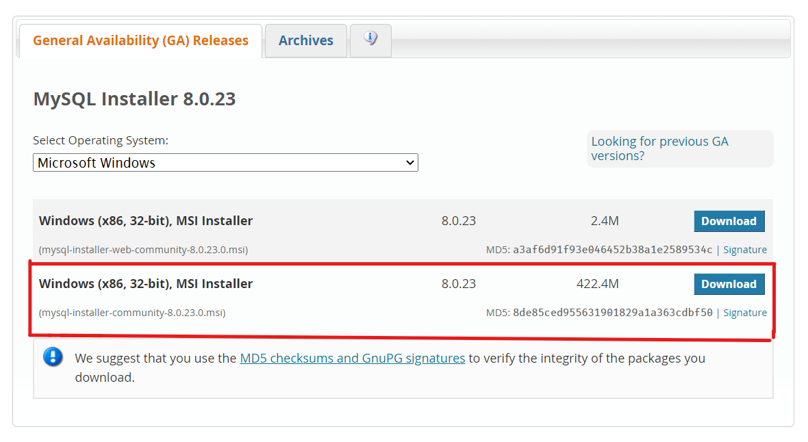
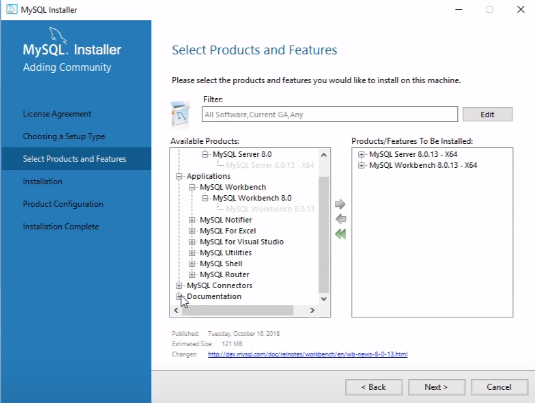

# Breads API

An Express REST API service, Python web scraper, and MySQL database for [breads.io](https://www.breads.io/). See [breads-client](https://github.com/aTmb405/breads-client) for front end code and more details about the project.

## Table of Contents
<<<<<<< HEAD

- [Installing](https://github.com/aTmb405/breads-server/blob/master/README.md#Installing)
- [Running](https://github.com/aTmb405/breads-server/blob/master/README.md#Running)
- [Testing](https://github.com/aTmb405/breads-server/blob/master/README.md#Testing)
- [Deploying](https://github.com/aTmb405/breads-server/blob/master/README.md#Deploying)
- [Technologies](https://github.com/aTmb405/breads-server/blob/master/README.md#Technologies)

## Installing

After you have forked the project and downloaded the code, install the necessary dependencies using [npm](https://docs.npmjs.com/about-npm/) or [yarn](https://yarnpkg.com/getting-started).

To install the packages through npm, run the command `npm install`

To install the packages through yarn, run the command `yarn add`

NOTE: In the rest of the documentation, you will come across npm being used for running commands. To use yarn in place of npm for the commands, simply substitute npm for yarn. Example, `npm start` as `yarn start`. For more help, checkout [migrating from npm](https://classic.yarnpkg.com/en/docs/migrating-from-npm/).

## Running

- Install the dependencies with `yarn` or `npm install`
- Create a local mySQL database.

  **For Windows:**

  If you are installing mySQL for the first time follow the following steps.

  - Download mySQL `mysql-installer-community-8.0.23.0.msi` from [here](https://dev.mysql.com/downloads/windows/installer/8.0.html).

    

  - Open the installer, agree with the licence and choose custom installer option and press next.
  - Select Product and Features

    

    

    and then click on Next.

  - Click on next till you reach Authentication Method, in Authentication Method choose
    `Use Legacy Authentication Method`
  - Set password for the root. And click on Next till the installation will finish.

- Now open the MySQL Workbench and create a database with `CREATE DATABASE bread_server`

### 1. Import seed data

- `mysql -u [USERNAME] -p [DATABASE] < mysql/tables.sql` - create tables
- `mysql -u [USERNAME] -p [DATABASE] < mysql/import.sql` - import data

### 2. Add environment variables

- `LOCAL_CORS` - frontend url (i.e. 'http://localhost:3000')

  **MySQL**

- `LOCAL_HOST` - local MySQL hostname
- `LOCAL_USER` - local MySQL username
- `LOCAL_DBPASSWORD` - local MySQL password
- `LOCAL_DB` - local MySQL database name

  **JWT** - create a secret key for JWT based authentication

- `SECRET_KEY` - JWT secret key

  **[Cloudinary](https://cloudinary.com/)** - Used for image hosting. Set up a free account to get a cloud name, API key, and API Secret _(only needed if working on user CRUD)_

- `CLOUDINARY_CLOUD_NAME` - Cloud Name
- `CLOUDINARY_API_KEY` - API Key
- `CLOUDINARY_API_SECRET` - API Secret

  **[Link Preview](https://www.linkpreview.net/)** - Used as a fallback for the webscraper. Set up a free account to get an API key _(only needed if working on webscraper)_

- `LINK_PREVIEW_KEY` - API Key

  **Nodemailer** - Used to send password reset emails. Add an email login information _(only needed if working on reset password feature)_

- `EMAIL_LOGIN` - email address
- `EMAIL_PASSWORD` - email password
- `EMAIL_URL` - frontend url (i.e 'http://localhost:3000')

### 3. Run `npm start`

## Testing

There are currently no tests. (This would be a great way to contribute!)

## Deploying

1. [Keep your fork in sync](https://www.freecodecamp.org/news/how-to-sync-your-fork-with-the-original-git-repository/) with this repository ([how to merge conflicts](https://opensource.com/article/20/4/git-merge-conflict)):

```
# Add a new remote upstream repository
git remote add upstream https://github.com/zero-to-mastery/breads-server.git

# Sync your fork
git fetch upstream
git checkout master
git merge upstream/master
```

2. Push changes to your repo:

`git push origin master`

3. In your repo GitHub page, create a pull request to the `development` branch. This will allow us to see changes in a staging environment before merging to `master`.

4. If everything runs correctly, your pull request will be merged into `master`.

## Technologies

- [Node.js](https://nodejs.org/en/)
- [Express](http://expressjs.com/)
- [Python](https://www.python.org/)
- [MySQL](https://www.mysql.com/)

### Near Future

- [CircleCI](https://circleci.com/)
- [Prettier](https://prettier.io/)
- [ESLint](https://eslint.org/)
=======
-   [Contributing](#contributing)
-   [Technologies](#technologies)

## Contributing

Please read through our [contributing guidelines](https://github.com/zero-to-mastery/breads-server/blob/master/CONTRIBUTING.md). Included are notes on development, directions for opening issues, coding standards, and a short explanation on the folder structure of the project.

## Technologies

-   [Node.js](https://nodejs.org/en/)
-   [Express](http://expressjs.com/)
-   [Python](https://www.python.org/)
-   [MySQL](https://www.mysql.com/)

### Near Future

-   [CircleCI](https://circleci.com/)
-   [Prettier](https://prettier.io/)
-   [ESLint](https://eslint.org/)
>>>>>>> upstream/master
